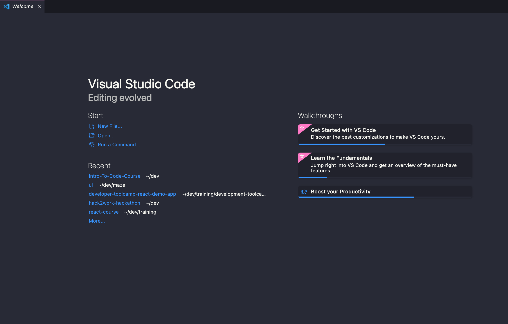

# Code the Future </>

## Session 1: The Developer Environment

### Content covered in this session

- [Session goals](#Session-goals)
- [What is an IDE](#What-is-an-IDE)
- [Using VSCode](#Using-VSCode)
- [File types and Syntax Highlighting](#File-types-and-Syntax-Highlighting)
- [Themes](#Themes)

### Session goals

- Learn what an IDE is and why we use them
- Become familiar with VSCode

### What is an IDE

An IDE, or Integrated Development Environment, enables programmers to consolidate the different aspects of writing a computer program.

IDEs increase programmer productivity by combining common activities of writing software into a single application: editing source code, building executables, and debugging.

An IDE can help you with many aspects of programming, for example, an IDE that knows the syntax of your language can provide visual cues to highlight specific features of a language and in some cases it can anticipate what you’re going to type next!

### Using VSCode

Note: if you haven't already downloaded VSCode, please use the following link to do so: [Download VSCode](https://code.visualstudio.com/)

#### What is VSCode

Visual Studio Code is a lightweight but powerful source code editor which runs on your desktop and is available for Windows, macOS and Linux. It comes with built-in support for many languages.

#### VSCode Layout

The interface is divided into five areas:

- Editor - The main area to edit your files. You can open as many editors as you like side by side vertically and horizontally.
- Side Bar - Contains different views like the Explorer to assist you while working on your project.
- Status Bar - Information about the opened project and the files you edit.
- Activity Bar - Located on the far left-hand side, this lets you switch between views and gives you additional context-specific indicators, like the number of outgoing changes when Git is enabled. You'll learn more about git in the Next section.
- Panels - You can display different panels below the editor region for output or debug information, errors and warnings, or an integrated terminal. Panel can also be moved to the right for more vertical space.

#### Opening and creating folders and files

When opening VSCode, you'll see a welcome screen that has options for 'New file' and 'Open folder'. You can use these to create new files/folders or open existing ones.

Alternatively, you can use the 'File', dropdown in the menu bar create or open files and folders. You also can save any files you create from this menu.

### File types and Syntax Highlighting

VSCode will highlight your code in specific colours for you to make your code more readable, so VSCode knows what needs to be highlighted you have to make sure you have the right file extension.

Here are some extensions we'll be using

- .md : Markdown file
- .html : Hypertext Markup Language file
- .css : Cascading Style Sheets file
- .js : JavaScript file

### Themes

#### Selecting the Color Theme

In VS Code, open the Color Theme picker with File > Preferences > Color Theme. (Code > Preferences > Color Theme on macOS).
You can also use the keyboard shortcut ⌘K ⌘T to display the picker.
Use the cursor keys to preview the colors of the theme.
Select the theme you want and press Enter.

You can find the perfect theme for you on the [VSCode marketplace](https://marketplace.visualstudio.com/search?target=VSCode&category=Themes&sortBy=Installs)!

Some of my favourites are:

- [Dracula](https://marketplace.visualstudio.com/items?itemName=dracula-theme.theme-dracula)
- [Rainglow](https://marketplace.visualstudio.com/items?itemName=daylerees.rainglow)
- [Pink cat boo](https://marketplace.visualstudio.com/items?itemName=ftsamoyed.theme-pink-cat-boo)

## Resources

- [VSCode keyboard shortcuts](https://code.visualstudio.com/assets/docs/getstarted/tips-and-tricks/KeyboardReferenceSheet.png)
- [VSCode tips and trips](https://code.visualstudio.com/docs/getstarted/tips-and-tricks)
- [VSCode intro videos](https://code.visualstudio.com/docs/getstarted/introvideos)

<a href='Meet_the_tutors.md' ><-- Previous section: Meet the Tutors</a>

<a  href='intro_to_github.md'>Next section: Introduction to Git & GitHub --></a>

