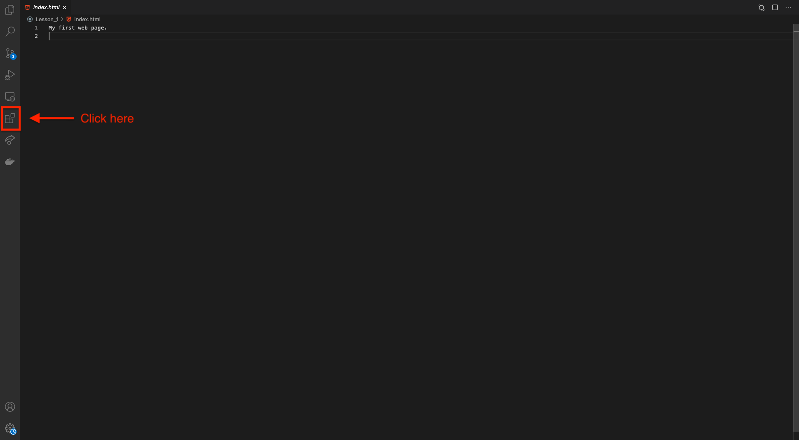

# Code the Future </>

## Session 2: Create your first webpage!

## Activity Walkthrough

Previously, we have seen a HTML element is made up of everything from the opening tag to the closing tag with the content in the middle.

Now we are going to focus on the tags themselves and how they can ben used to build up to a simple website!

## Creating your first webpage

## Step One

### Creating the main file for you website.

- Create a directory called `Intro-To-Code`. We can use this to store all our source code repositories from Github.

- Create an `index.html` page in your `Intro-To-Code` directory.

- This file is the main file which controls your website and will be the source of the majority of your content.

## Step Two

### Adding content

- Open up the file and simply type `My first website, my name is [name] and I am a [cat or dog person].`

## How to view your changes.

Visual Code offers a really useful extension which will allow you to see you app and it will even update as you make changes and save them.



- In the search bar type `live server` and click on the top option which is published by Ritwick Dey.

- Them simply click install and restart your VScode.

- You will then be able to right click on your index.html file and select **open with live server**.

- This should then open a new window in your default browser and you should see something like this:


## Step Three

### Adding the basic structure

We will start off with adding the code you saw in the Previous section on line two which is a good place to start with any index.html file!

    <!DOCTYPE html>
    <html>
        <head>
    	    <meta charset="utf-8">
    	    <title></title>
        </head>
        <body>
        </body>
    </html>

Just to quickly recap, `<!DOCTYPE html>` is the HTML declaration and not strictly a HTML tag but "informs" the browser of the type of language to expect. Here we are telling the browser to expect HTML 5.

Next have the `<html>` which tells the browser where the code itself is.

And finally we have the `<head>` and `<body>` tags. The head tag includes all of the additional information about the webpage and the body includes all of the content which will be displayed on the screen.

## Step Four

### The Final Step

- Add `My first website` between the title Tags to create a title that should now be displayed on the tab in your browser.
- Add a H1 tag in between the body tags and add `my name is [name]` which will give your website a header.
- Add a P tag into the body as well and add `and I am a [cat or dog person]`. This will have the effect of creating a paragraph, feel free to add more information about yourself using any HTML tags you like!

  Example

  ```
  <!DOCTYPE html>
    <html>
      <head>
        <title>My First Website</title>
      </head>
      <body>
        <h1>My name is Henry</h1>
        <p>And I am a cat person</p>
      </body>
    </html>
  ```

## Example finished activity

If you get stuck or would like some inspiration on what to add to you page, you can check out the [example finished activity](example-finished-activities/index_section_02_example.html)

## Resources

- [W3 Schools](https://www.w3schools.com/tags/default.asp)
- [MDN Web Docs](https://developer.mozilla.org/en-US/docs/Web/HTML/Element)

<div style="width: 100%">
<a href='dev_tools.md'><-- Previous section: Chrome Dev Tools</a>
<div align="right"><a href='../session-3/README.md'>Next section: Session 3 Introduction --></a></div>
</div>
