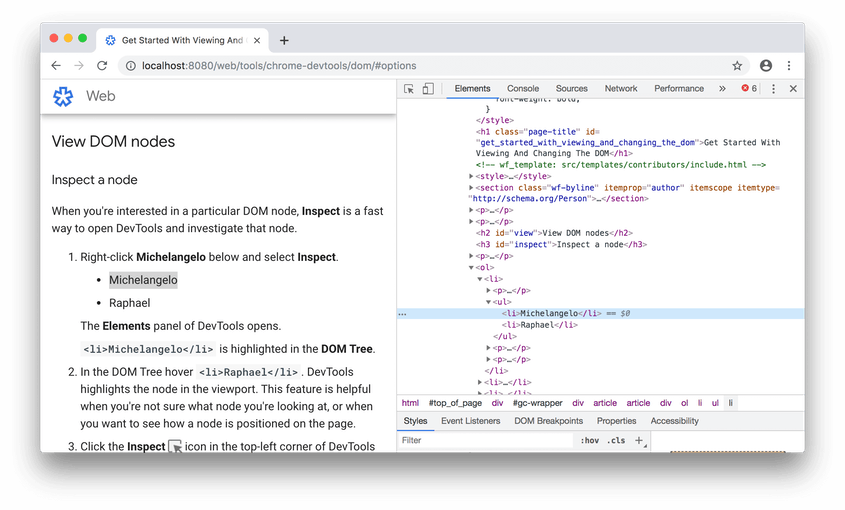
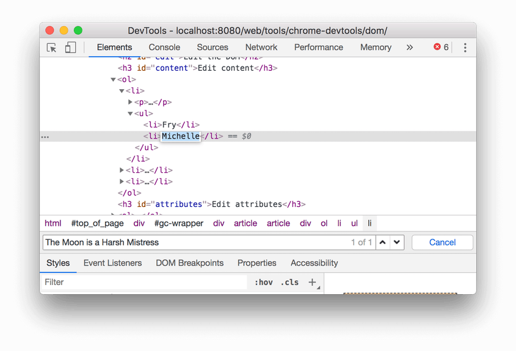

# Code the Future </>

## Session 2: Chrome Dev Tools

## Opening Dev tools

### In Chrome

- Right-click the element and select Inspect
  
- Or press Command+Option+C (Mac) or Control+Shift+C (Windows, Linux, Chrome OS).

## Using Dev tools

### View HTML

The DOM Tree of the Elements panel is where you do can see all the HTML elements used on a page in DevTools.

### Inspect an element

When you're interested in a part of the page, Inspect is a fast way to open DevTools and investigate that element.

If you select the arrow icon in the top left corner of Devtools, you will then be able to select elements in the page and the will be highlighted in the elements panel.

### Editing HTML

To edit attributes, double-click the element name or value, the text will be highlighted blue to indicate that it is selected and you can change the content to what you like.

When you edit elements inside dev tools these changes won't be saved in your codebase, but it's a great way of prototyping changes.

## Quick Activity

In this activity, you're going to inspect the html that makes up one of your favourite sites to see what elements they're using.
This will help you get familiar with using dev tools and see how some of the elements you've learned about so far are used in live sites.
There will likely some elements you're not familiar with yet but don't worry! Take a look through and see if you can figure out what they're used for, you can also check on [W3 Schools](https://www.w3schools.com/tags/default.asp) if you're not sure.

1. Go to one of your favourite pages and inspect the page. If you're not sure where to look, here's some sites you can take a look at:

- [FreeCodeCamp](https://www.freecodecamp.org/)
- [Codecademy](https://www.codecademy.com/)

2. See what elements they are using, inspect some of them and see if you can change any of the content.
3. Pick out a few of the elements that they have used that you've not seen before and see if you can use [W3 Schools](https://www.w3schools.com/tags/default.asp) to find out what they are.

## Resources

- [Dev tools docs - Overview](https://developer.chrome.com/docs/devtools/overview/)
- [Dev tools docs - Editing HTML](https://developer.chrome.com/docs/devtools/dom/)

<a href='html_basics.md'><-- Previous section: HTML Basics</a>

<a href='create_webpage.md'>Next section: Create your first webpage --></a>

