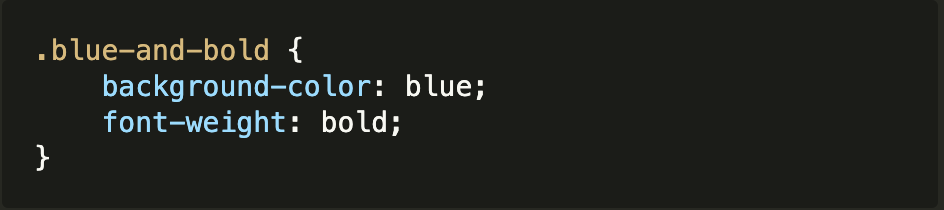
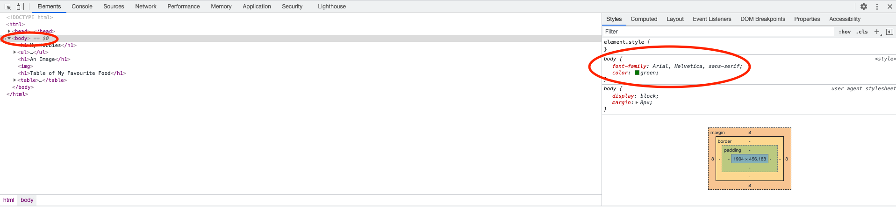

# Code the Future </>

## Session 4: Basic CSS

### What is CSS?

- **CSS** = **C**ascading **S**tyle **S**heets
  - A styling language used for website layout and design.
  - You can choose the fonts, colors, layout, etc. of a web page.
    - It makes your web pages less bland and more attractive!!
  - This is **not** a Programming Language.

## How to Use CSS with HTML

### Inline CSS

- Small segments of CSS written into the code in an HTML Element.
- The style is only applied to a single element.

  ```html
  ...

  <p style="color:blue">Hello World!!</p>
  ```

### Internal CSS

- Using `<style>` tags within the header section of the HTML file.
- The style is only applied in that single HTML file.

  ```html
  ...
  <html>
  	<head>
  		<title>My First Website</title>

  		<style type="text/css">
  			h1 {
  				color: blue;
  			}
  		</style>
  	</head>
  	<body>
  		<h1>This text is blue</h1>
  	</body>
  </html>
  ```

### External CSS

- Linking an external (separate) `.css` file.
- This can be re-used in one or more HTML files (when it is imported) and it also enables separation of presentation and content.

  ```html
  <!-- HTML File (index.html) -->
  ...

  <head>
  	<title>My First Website</title>
  	<link rel="stylesheet" type="text/css" href="myStyleSheet.css" />
  </head>
  ```

  ```css
  /* CSS File located in the same directory as index.html (myStyleSheet.css) */
  p {
  	color: blue;
  }
  ```

## CSS Syntax

CSS syntax consists of a plain text called a _Style Sheet_ which are separated into blocks of code containing _rules_.


It has [_Selectors_](#selector) that declare the elements in the HTML Document where the style is applied. This is followed by a [_Declaration Block_](#declaration) enclosed by curly braces that contains one or more [_Declarations_](#declaration), separated by a semicolon. Each _Declaration_ includes a [_Property_](#property), a colon, and its [_Value_](#value).

White spaces are ignored - declarations can be written in separate lines to make it more readable.

```css
p {
	color: blue;
	font-weight: bold;
	font-size: 14px;
}
```

### Selector

- The selectors are used to target a specific element or range of elements, where a style is applied on a web page.
- There is a [wide range of selectors](advanced_css.md/#css-selectors-advanced) and each selector can have an `ID` and/or `Class` attributes.

  > **Class Attribute** <br/>
  > This attribute allows you to define style rules that apply to _more than one element_.<br/>
  > The example below shows a `class` called `blue-and-bold` applied to a paragraph `<p>` selector. <br/> > <br/>
  > To declare rules in your CSS for that `class`, write a separator prefixed with a `"."`. The style defined here is applied to any HTML element with `class="blue-and-bold"`.
  >  > <br/><br/> > **ID Attribute** <br/>
  > This attribute only allows you to define style rules that apply to _a single element_. The `id` attribute is a unique identifier within the document and cannot share the same `id` value in the same web page.<br/>
  > The example below shows multiple Paragraph `<p>` elements with different `id`'s. <br/> > <br/>
  > To declare rules in your CSS for each `id`, write a separator prefixed with a `"#"`.<br/> > <br/>

### Declaration

- The Selector is followed by a _Declaration Block_, enclosed with curly braces`{}`, that contains one or more _Declarations_ or rules.
- Each _Declaration_ contains a [_Property_](#Property) and a [_Value_](#Value).

### Property

- Name of the attribute you want to style for example `border`, `color`, `background`, `position` etc.
- A property must have a Value.

### Value

- This defines the Property or the values allocated for the Property.

---

## Web Browser Developer Tools

Modern web browsers have support for web developer tools (_devtools_) that will help designers/developers debug the front-end. This is covered in more detail in Session 2 or click on each link to learn more about the different devtools for each web browser:

- [Firefox](https://developer.mozilla.org/en-US/docs/Tools)
- [Google Chrome](https://developer.chrome.com/docs/devtools/)
- [Internet Explorer and Microsoft Edge](<https://docs.microsoft.com/en-us/previous-versions/windows/desktop/legacy/hh968260(v=vs.85)>)
- [Safari](https://support.apple.com/en-gb/guide/safari/sfri20948/mac)
- [Opera](https://dev.opera.com/extensions/dev-tools/)

For this example, we will use Chrome. To view the styles applied on the page, select an element and the styles defined for that element will be displayed in the tab called **Styles**.



<div style="width: 100%">
<a href='README.md'><-- Previous section: Session 4 Introduction</a>
<div align="right"><a href='advanced_css.md'>Next section: Advanced CSS --></a></div>
</div>
