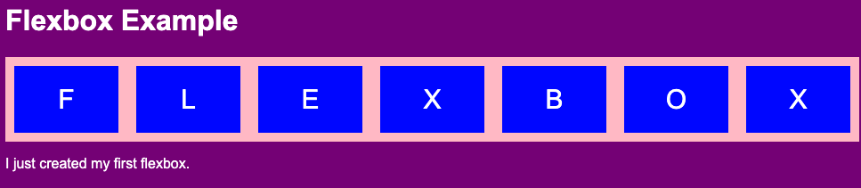
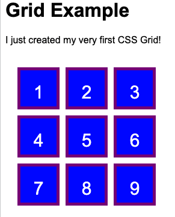

# Code the Future </>

## Session 4: Activities

_NOTE: Read through and try to understand the code snippets provided above. Change the values of each property and see how it can impact the elements on the webpage. If you have any questions, reach out to the tutors._

## Activity 1: Styling your Webpage

In this exercise, you will add styling to your `index.html` page that you've created and updated in Sessions 2 and 3.

1. In Visual Studio, open the directory where your `index.html` is stored and create a new CSS file called `mystylesheet.css`
2. Open the `mystylesheet.css`, copy the following text and save the file:

   ```css
   .greentext {
   	font-family: Arial, Helvetica, sans-serif;
   	color: green;
   }
   ```

   _Note: You can change the color to anything you want. You can either use the actual [color names supported by all browsers](https://www.w3schools.com/cssref/css_colors.asp) or use [hexcodes](https://htmlcolorcodes.com/) by replacing the word "green" with a hexcode (e.g. `color: #008000;`)_

3. Open your `index.html` then add the following inside the `<head>` section

   ```html
   <link rel="stylesheet" href="mystylesheet.css" />
   ```

4. In the `index.html`, add two new paragraphs inside the `<body>` element, one with class `.greentext` and save the file
   ```
   <p>This is the first paragraph</p>
   <p class="greentext">This is another paragraph, which is green and using a different font</p>
   ```
5. Open `index.html` on a web browser (or right click on the `index.html` and click on "Open with Live Server") and you should see the two new paragraphs you've added - the second one is green with a different font

6. Experiment with your page and make some changes to the CSS to style your page however you want (e.g. change the background of your page, apply different sizes to your font, change the alignment of the text, etc.)

---

## Activity 2: Adding Layout to a Webpage

### 2.1 Using Flexbox

For this activity, we are going to create this on a webpage to understand how to use Flexbox.



1. Open Visual Studio code and create a new HTML file and call it `flexbox_sample.html` and a new CSS file and call it `layout_stylesheet.css`
2. Open the `flexbox_sample.html` and copy the following and save the file

   ```html
   <!DOCTYPE html>
   <html>
   	<head>
   		<title>Flexbox Example</title>
   		<link rel="stylesheet" href="layout_stylesheet.css" />
   	</head>
   	<body id="flexbox-demo-bg">
   		<h1>Flexbox Example</h1>
   		<div class="flex-container">
   			<div class="flex-item">F</div>
   			<div class="flex-item">L</div>
   			<div class="flex-item">E</div>
   			<div class="flex-item">X</div>
   			<div class="flex-item">B</div>
   			<div class="flex-item">O</div>
   			<div class="flex-item">X</div>
   		</div>
   		<p>I just created my first flexbox.</p>
   	</body>
   </html>
   ```

3. Open the `flexbox_sample.html` in a web browser (or right click on html file and click on "Open Live Server") to view the changes you've made

4. Add some styling to this by copying the following into `layout_stylesheet.css` and save the file

   ```css
   * {
   	font-family: Arial, Helvetica, sans-serif;
   }

   body {
   	background-color: white;
   	color: black;
   }

   /* Styling Flexbox */
   #flexbox-demo-bg {
   	background-color: purple;
   	color: white;
   }

   .flex-container {
   	display: flex;
   	flex-wrap: nowrap;
   	background-color: pink;
   }

   .flex-item {
   	background-color: blue;
   	width: 100px;
   	margin: 10px;
   	text-align: center;
   	line-height: 75px;
   	font-size: 30px;
   }
   ```

5. View on the web browser are (refresh the page if you can't see the changes). It should look like the Flexbox Example screenshot above

### 2.2 Using Grid

For this activity, we are going to create this on a webpage to understand how to use Grids.



1. Open Visual Studio code and create a new HTML file and call it `grid_sample.html` and copy the following and save the file

   ```html
   <!DOCTYPE html>
   <html>
   	<head>
   		<title>Grid Example</title>
   		<link rel="stylesheet" href="layout_stylesheet.css" />
   	</head>
   	<body>
   		<h1>Grid Example</h1>
   		<p>I just created my very first CSS Grid.</p>
   		<div class="grid-container">
   			<div class="grid-item">1</div>
   			<div class="grid-item">2</div>
   			<div class="grid-item">3</div>
   			<div class="grid-item">4</div>
   			<div class="grid-item">5</div>
   			<div class="grid-item">6</div>
   			<div class="grid-item">7</div>
   			<div class="grid-item">8</div>
   			<div class="grid-item">9</div>
   		</div>
   	</body>
   </html>
   ```

2. Open the `grid_sample.html` in a web browser (or right click on html file and click on "Open Live Server") to view the changes you've made

3. Open `layout_stylesheet.css` and add the following after the last line in the file

   ```css
   /* Styling Grid */
   .grid-container {
   	display: grid;
   	grid-template-rows: 100px 100px 100px;
   	grid-template-columns: 100px 100px 100px;
   	row-gap: 10px;
   	column-gap: 20px;
   }
   .grid-item {
   	background-color: blue;
   	color: white;
   	border: 3px solid purple;
   	width: 100px;
   	text-align: center;
   	line-height: 100px;
   	font-size: 30px;
   }
   ```

4. View on the web browser are (refresh the page if you can't see the changes). It should look like the Grid Example screenshot above

---

## Activity 3: Style and Add Layout to your Web Page

Using the skills you've learned for this session, change your `index.html` to improve the appearance of your web page to your preference. You can also change the layout of your page to add headers/footers, navigation bar, etc. Here are some sample [CSS Templates](https://www.w3schools.com/css/css_templates.asp) for inspiration.

_BONUS: Use one of the CSS Frameworks of your choice (can be one of the examples mentioned above or something else) and apply it to your web pages._

_EXTRA ACTIVITY: For testing out oyur knowlwdge on Flexbox and Grid you can visit these sites [Flexbox Froggy](https://flexboxfroggy.com/) and [Grid Garden](https://cssgridgarden.com/)._

<div style="width: 100%">
<a href='introduction_to_css.md'><-- Previous section: Advanced CSS</a>
<div align="right"><a href='../session-5/README.md'>Next section: Session 5 Accessibility and Personal Project Planning --></a></div>
</div>
