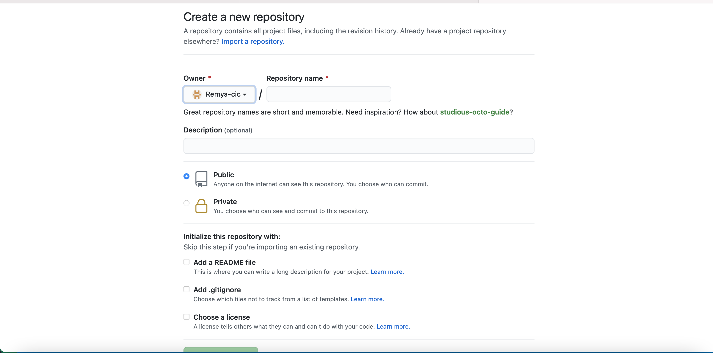
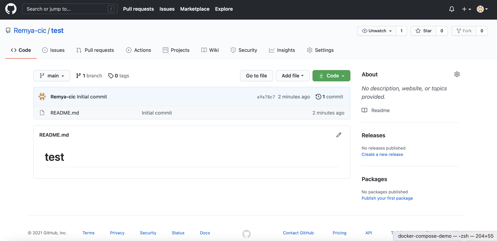
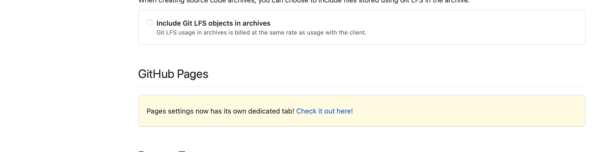
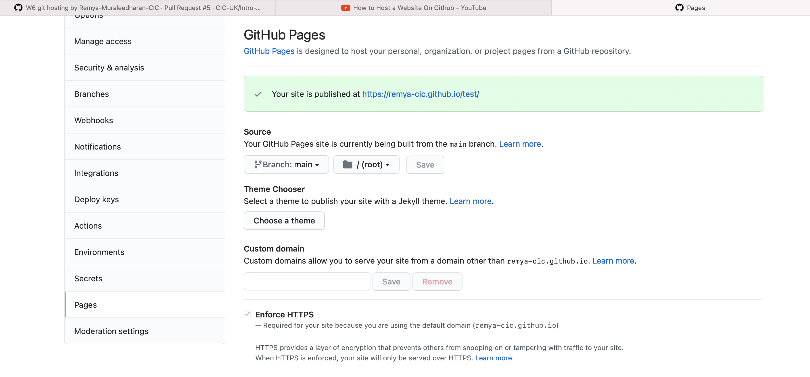
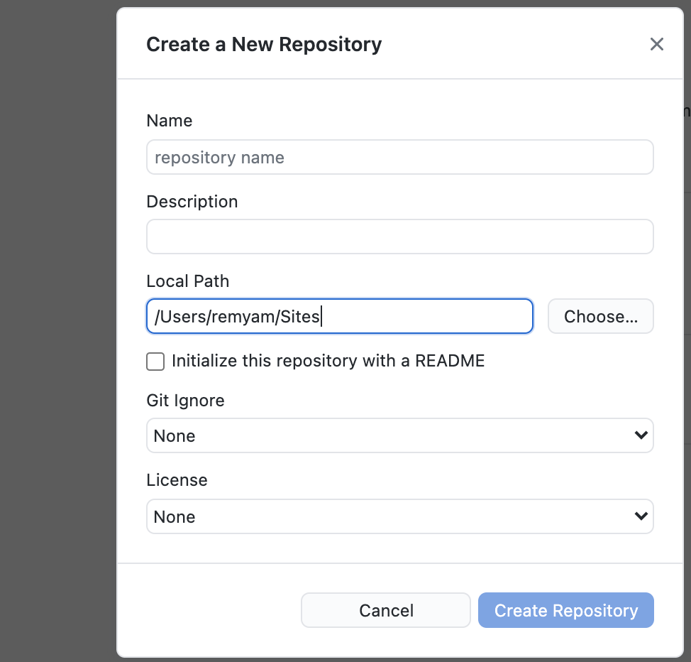

## Steps for Hosting a Website on GitHub

# Create GitHub account

1. Signing up for a new GitHub account Goto `https://github.com/`
   GitHub offers user accounts for individuals and organizations for teams of people working together.
   Go to GitHub's Pricing `https://github.com/pricing` page.
   Read the information about the different products and subscriptions that GitHub offers, then click the upgrade button under the subscription you'd like to choose. (choose free plan for now).
   Follow the prompts to create your personal account or organization.

# Host a Website On Github

1. Sign into `https://github.com/` using your account.
2. Click the 'New Repository' button, which will look like:

3. Enter the repository name, description (it is optional), click create repository button.

4. Click Add button drop down and click upload files. Then Commit all the files.

5. Then go to Settings tab, drop down go to GitHub pages section. Which looks like below:

Click `check it out here`, Select your Source (by default it is none) , click save. Then you will your site is published and you will get the url.

## Using GitGub Desktop

1. Download either [GitHub for Mac][1] or [GitHub for Windows][2], depending on your operating system.
   Open the downloaded application file and continue through the installation process as required with your computer’s operating system.
2. Create a new GitHub project
   Before we upload our code to GitHub we first need to make GitHub Desktop aware of our project files. We do this by creating a new Repository folder, then copy our website files to this new folder.

   1. Open up the GitHub Desktop app and click the “Create New Repository” button.
   2. When the “Create a New Repository” dialog window appears, fill in the “Name” text input as: [username].github.io (Replace [username] with your GitHub account username.)
      Note: It’s very important to name your repository in this manner; this will tell GitHub to host the files in this project automatically and display them when someone points their browser to:
      `https://[username].github.io/`
      This will be the web address you will share when your site is ready to publish and go live!
   3. The “Local Path” text input is where your repository will live on your computer; this is not where your website files currently reside on your computer’s hard drive. GitHub Desktop needs to create a new, empty folder.
      We will need to copy your site files over later, but for now, select a folder such as /Sites in your home folder. This will create a new folder inside the /Sites folder with the name of your repository, which will look like:

   

   4. Leave all the other options in the form at their default settings and click the “Create Repository” button. For now we just want to create the folder which GitHub Desktop will recognize as a folder it can work with. For the sake of the guide, let’s describe this new folder as your GitHub Repository folder.

3. Copy your files to the new Repository folder
   Copy everything in your working folder into your GitHub Repository folder (/Sites/[username].github.io)
   With all our files in the GitHub Repository folder, we’re ready to commit our files!
   Before we commit our files for publishing, we first need to tell GitHub what this commit is all about.
   Once the “Summary” and optional “Description” fields are filled out to your liking, click the “Commit to master” button!

4. Publish your website

   Now that our files are committed, this allows us to push our commit to GitHub!
   Find the “Publish repository” button along the top of the GitHub Desktop interface.
   When the “Publish Repository” dialog window appears after clicking the “Publish repository” button, it will first prompt you to sign-in to GitHub if you haven’t yet already.
   Click the “Sign In” button to show the “Sign In” dialog window; fill in your Username and Password and click the “Sign In” button to complete the process. You should now be logged in and good to proceed!

   The “Publish Repository” dialog window will appear with a last few options for you to choose from before placing your website live.
   All the options in the form are fine as-is except the “Keep this code private” checkbox; if you want to share your code.

   Click the “Publish Repository” button to send your files up to GitHub!
   Now, in your browser, go to your new GitHub repository page to make sure your files made the journey to their new home:
   https://github.com/[username]/[username].github.io

5. Share your website!
   You can access your website in browser using https://[username].github.io/

## Using a custom domain name

You can just leave your website at that address (it'll give you some serious street cred in the developer world), but if you have a custom domain you would like to use, it is very simple to make GitHub redirect your page.

1. Log in to your domain registrar and find where to change your host records. If you don't know, you can usually Google "(domain registrar) change host records", and your registrar will have an explainer telling you how to do it.
2. Change your domain's A Record to 204.232.175.78. This is GitHub's IP address, which allows GitHub to resolve your URL and serve the correct files.
3. In your website's directory folder on your computer, create a file called "CNAME". On the first line, type your domain name. Save the file.
4. In your GitHub application, you should see the file in the left column. Make sure it is checked and enter your commit message. Have it say something like "Adding CNAME file."
5. Click "Sync branches."

It can take as long as 48 hours for your domain to resolve to your GitHub page. However, it is usually pretty quick, so check back in an hour or so.

[1]: http://mac.github.com/
[2]: http://windows.github.com/

<a href='README.md'><-- Previous section:  Session 6 Introduction</a>

